```mermaid
graph TB
    subgraph "Frontend Layer"
        UI[Vue 3 Vapor + Nuxt 4]
        Store[Pinia Store]
        Valid[Vee-Validate]
        UI --> Store
        UI --> Valid
    end

    subgraph "Desktop Runtime"
        Tauri[Tauri 2<br/>Rust Core]
        UI --> Tauri
    end

    subgraph "Backend Layer"
        API[ASP.NET Core 10<br/>REST API]
        Auth[Identity + JWT]
        Valid2[FluentValidation]
        PDF[QuestPDF]
        Log[Serilog]
        
        API --> Auth
        API --> Valid2
        API --> PDF
        API --> Log
    end

    subgraph "Data Layer"
        EF[Entity Framework Core 10]
        SQLite[(SQLite 3.45<br/>SQLCipher)]
        Cache[(Valkey 8<br/>Cache)]
        
        API --> EF
        EF --> SQLite
        API --> Cache
    end

    Tauri <--> |IPC/HTTP| API

    style UI fill:#42b883
    style Tauri fill:#ffc131
    style API fill:#512bd4
    style SQLite fill:#003b57
    style Cache fill:#dc382d
```

# OrbeERP
Repositorio general de ORBE

## 🚀 Stack Tecnológico

Orbe está construido con tecnologías de vanguardia, priorizando rendimiento, seguridad y experiencia de desarrollo moderna.

### Backend
- **.NET 10** (C# 14) - Framework de alto rendimiento con soporte empresarial LTS
- **Entity Framework Core 10** - ORM moderno con migraciones automáticas
- **ASP.NET Identity + JWT** - Autenticación segura basada en tokens
- **FluentValidation 11** - Validación robusta de modelos de negocio
- **QuestPDF** - Generación eficiente de documentos PDF para facturación
- **Serilog 4** - Logging estructurado con múltiples destinos
- **xUnit** - Framework de testing con arquitectura extensible

### Frontend
- **Vue 3.6+ (Vapor Mode)** - Reducción de 50% en tamaño de bundle y mejor rendimiento
- **Nuxt 4** - Meta-framework con SSR/SSG y optimizaciones automáticas
- **Pinia 2.2** - Gestión de estado oficial de Vue con DevTools integradas
- **Vee-Validate 4** - Validación de formularios reactiva
- **PrimeVue 4** - Suite completa de componentes UI empresariales
- **Vitest 2** - Testing ultrarrápido compatible con Vite

### Infraestructura
- **SQLite 3.45+** - Base de datos embebida de alto rendimiento
- **SQLCipher** - Cifrado transparente de datos sensibles
- **Valkey 8** - Cache en memoria de alta velocidad (fork Redis)
- **Tauri 2** - Aplicaciones nativas ligeras (~10MB) con núcleo Rust

### Herramientas
- **Scalar** - Documentación API interactiva y moderna
- **GitHub Actions** - CI/CD automatizado para builds multiplataforma

---

## 📐 Arquitectura del Sistema

---

## 🎯 Decisiones Técnicas

**¿Por qué Vapor Mode?** Reduce el overhead del Virtual DOM, generando código 50% más ligero y rápido.

**¿Por qué Tauri sobre Electron?** Binarios 10x más pequeños, consumo de memoria 3x menor, y mayor seguridad con sandboxing nativo.

**¿Por qué SQLite?** Cero configuración, portabilidad completa, y rendimiento excepcional para aplicaciones de escritorio (<100GB datos).

**¿Por qué Valkey?** Compatible 100% con Redis pero con gobernanza open-source garantizada bajo Linux Foundation.

---

## 🎨 Diseño y Documentación de UX/UI

Esta sección provee acceso a los artefactos de diseño y la documentación de decisiones para las interfaces de usuario de Orbe.

### Orbe POS - Mockups y Documentación

Para la versión del Punto de Venta (POS) de Orbe, se han generado los siguientes recursos:

*   **Mockups Visuales (Excalidraw):** Explora los diseños visuales y flujos de usuario en el directorio de mockups.
    [Acceder a Mockups POS](design/pos/mockups/)

*   **Documentación de Decisiones de Diseño:** Consulta la justificación, pautas y decisiones clave detrás de los diseños.
    [Leer Documentación de Diseño POS](docs/design/pos_design_decisions.md)